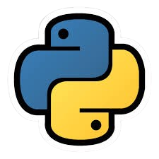

# PyQuizMaster: Python MCQs Platform

<div align="center">
  
  <h3>Master Python through interactive quizzes</h3>
</div>

## 🚀 Overview

PyQuizMaster is a modern, interactive platform designed to help learners test and improve their Python programming knowledge through carefully crafted multiple-choice questions (MCQs). The platform covers a wide range of Python topics from basic syntax to advanced concepts, making it suitable for beginners and experienced developers alike.

## ✨ Features

- **📚 Comprehensive Topics** - 13 different Python topics including Data Types, Functions, OOP, Exceptions, and more
- **🔍 Difficulty Levels** - Questions categorized as Beginner, Intermediate, and Advanced
- **💻 Interactive UI** - Modern, responsive interface with animations and intuitive navigation
- **⏱️ Timed Quizzes** - Test your knowledge under time constraints
- **📊 Result Analysis** - Detailed breakdown of performance with correct answers
- **📱 Fully Responsive** - Seamless experience across devices of all sizes
- **🎨 Beautiful Design** - Elegant UI with smooth animations and transitions

## 🛠️ Technologies

- **Framework**: Next.js 15
- **UI**: React, Tailwind CSS, Framer Motion
- **Icons**: React Icons
- **Deployment**: Vercel

## 🔧 Getting Started

### Prerequisites

- Node.js (v18 or higher)
- npm or yarn

### Installation

1. Clone the repository:
   ```bash
   git clone https://github.com/AliAskariGithub/Python_MCQs_Website.git
   cd Python_MCQs_Website
   ```

2. Install dependencies:
   ```bash
   npm install
   # or
   yarn install
   ```

3. Run the development server:
   ```bash
   npm run dev
   # or
   yarn dev
   ```

4. Open [http://localhost:3000](http://localhost:3000) in your browser.

## 🏗️ Project Structure

```
python-mcqs-platform/
├── app/                    # Next.js app router
│   ├── about/              # About page
│   ├── contact/            # Contact page
│   ├── privacy/            # Privacy policy page
│   ├── quiz/               # Quiz pages
│   ├── result/             # Quiz results page
│   ├── topics/             # Topics selection page
│   └── page.tsx            # Home page
├── components/             # Reusable components
│   ├── CodeBlock.tsx       # Code snippet display
│   ├── Footer.tsx          # Site footer
│   ├── Navbar.tsx          # Navigation bar
│   └── ...                 # Other components
├── lib/                    # Utility functions and data
│   └── data.ts             # MCQs database
├── public/                 # Static assets
│   ├── images/             # Images used in the app
│   └── ...                 # Other assets
└── types/                  # TypeScript type definitions
```

## 💡 Usage

1. **Choose a Topic**: Browse the available Python topics on the homepage or topics page.
2. **Select Difficulty**: Choose between Beginner, Intermediate, or Advanced level.
3. **Take the Quiz**: Answer multiple-choice questions within the time limit.
4. **Review Results**: See your score and review correct answers after submission.

## 🌟 Key Features In Detail

### Topic Selection
Browse through 13 different Python topics, each with a unique visual representation and description.

### Interactive Quizzes
Engaging quiz interface with progress tracking, timer, and smooth transitions between questions.

### Detailed Results
Comprehensive breakdown of your quiz performance, highlighting correct and incorrect answers.

## 📊 MCQs Database

The platform includes hundreds of carefully crafted Python MCQs across various topics:

- Google Colab
- Introduction to Python
- Data Types
- Lists, Tuples & Dictionaries
- Sets & Collections
- Functions
- Object-Oriented Programming
- Modules & Packages
- File Handling
- Exception Handling
- Regular Expressions
- Testing in Python
- Code Output

## 🤝 Contributing

Contributions are welcome! Please feel free to submit a Pull Request.

1. Fork the repository
2. Create your feature branch (`git checkout -b feature/amazing-feature`)
3. Commit your changes (`git commit -m 'Add some amazing feature'`)
4. Push to the branch (`git push origin feature/amazing-feature`)
5. Open a Pull Request

## 📜 License

This project is licensed under the MIT License - see the LICENSE file for details.

## 📧 Contact

For any questions or feedback, please reach out through the contact form on the website or create an issue in the repository.

---

<div align="center">
  <p>Built with ❤️ by Ali Askari</p>
</div>
